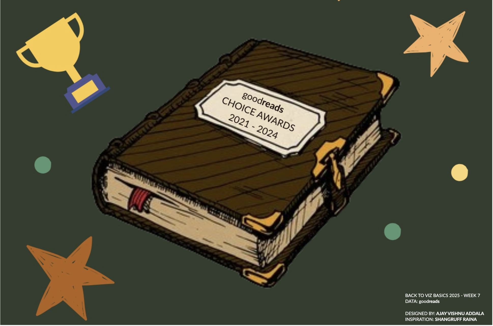

# Goodreads Choice Awards Dashboard

This Tableau dashboard visualizes the winners of the Goodreads Choice Awards from 2021 to 2024 using an interactive treemap. The treemap highlights the awards across different genres, books, and authors, providing an engaging way to explore the data.

## Features

- **Switchable Views:**
  - Explore the treemap by **Genre**, **Book**, or **Author**.
  - **Author View:** Click on an author to see all their winning books over 2021-2024.
  - **Genre and Book Views:** Filter the treemap by year to explore the winners for that specific period.

- **Theme:**
  - Designed using the **Goodreads Choice Awards** color scheme.
  - The dashboard is styled to resemble the pages of a book, adding a personal and thematic touch.

## Snapshot

## Tableau Public Link

Explore the interactive dashboard on [Tableau Public](https://public.tableau.com/views/GoodreadsChoiceAwards2021-2024BuildaTreeMapB2VB2025W7/Opening?:language=en-US&:sid=&:redirect=auth&:display_count=n&:origin=viz_share_link).

## Dataset

The dataset includes the following fields:

- **Year:** The year the book won a Goodreads Choice Award.
- **Genre:** The category or genre the book won in.
- **Book:** The title of the winning book.
- **Goodreads URL:** A link to the book’s Goodreads Choice Awards page.
- **Author:** The author of the book.
- **Votes:** The number of votes the book received in the awards.

